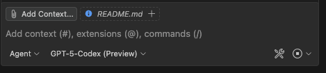
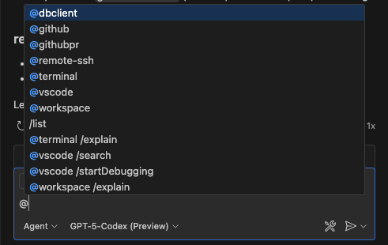
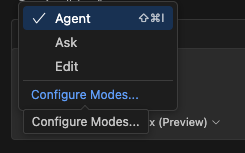
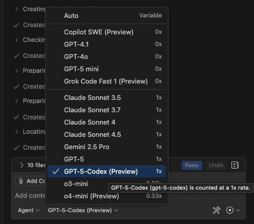

# GitHub Copilot Handbook

Your one-stop playbook for pairing with GitHub Copilot, GitHub Copilot Chat, and the latest Copilot agents. Start with the fundamentals, then graduate to advanced workflows, model selection, and prompt patterns that keep you shipping fast.

## Quick navigation

- [What you'll find](#what-youll-find)
- [Jump in](#jump-in)
- [Visual index](#visual-index)
- [Repository map](#repository-map)
- [Bonus resources](#bonus-resources)

## What you'll find

- **Step-by-step walkthroughs** with annotated screenshots and SVG illustrations.
- **Context mastery**: how to reference repositories, folders, terminals, and more with `#` and `@` helpers.
- **Model guidance**: when to reach for GPT-5, GPT-5-Codex, or Claude Sonnet 4.5.
- **Agent modes decoded**: Ask, Edit, and Agent—with tactics for when to switch and delegate.
- **Prompt batteries included**: reusable snippets for codebase exploration, debugging, and refactors.

## Jump in

1. 🧭 **New to Copilot?** Start with [Getting started & inline chat](guides/basics/README.md)
2. 🧩 **Need sharper answers?** Learn [How to add rich context with `#` and `@`](guides/context/README.md)
3. ✍️ **Sharpen your prompts?** Browse the [Prompt engineering playbook](guides/prompts/README.md)
4. 🧠 **Picking a model?** Check [Model selection cheat sheet](guides/models/README.md)
5. 🛡️ **Want Copilot to review your diff?** Follow [Code reviews in VS Code](guides/reviews/README.md)
6. � **Ready for more?** Explore [Advanced workflows, debugging, and automation](guides/advanced/README.md)

## Visual index

| Topic | Preview |
| --- | --- |
| Adding context |  |
| Inline chat |  |
| @ mentions |  |
| Agent modes |  |
| Model picker |  |

## Repository map

```
.
├── images/                # SVG illustrations used across the guides
└── guides/
	├── basics/            # First-run setup, inline chat, quick wins
	├── context/           # `#` references, `@` mentions, multi-file focus
	├── prompts/           # Prompt engineering playbook & reusable templates
	├── models/            # Model capabilities and selection advice
	├── reviews/           # Copilot-assisted code reviews inside VS Code
	└── advanced/          # Debugging, refactors, agent modes, automations
```

> 💡 **Tip:** Browse each guide in order—the later chapters build on the prompts, shortcuts, and images from earlier sections.

> 🎉 **Fun fact:** This repo was crafted with GitHub Copilot’s **GPT-5-Codex (Preview)** model. Peek at the full build-out in the [chat history](./chat.json).

## Bonus resources

- [Awesome GitHub Copilot Customizations](https://github.com/github/awesome-copilot) – Community-curated prompts, instructions, chat modes, and MCP integrations you can install to extend the workflows in this handbook.
