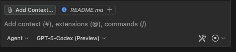

# Getting started with GitHub Copilot

Pair with Copilot like a pro in under 15 minutes. This quick-start guide walks through setup, the Copilot Chat panel, inline chat inside the editor, and easy wins that build confidence fast.

### Quick navigation

- [1. Install & sign in](#1-install--sign-in)
- [2. Meet Copilot Chat](#2-meet-copilot-chat)
- [3. Inline chat inside the editor](#3-inline-chat-inside-the-editor)
- [4. Add laser-focus context](#4-add-laser-focus-context)
- [5. Quick wins to try today](#5-quick-wins-to-try-today)
- [6. Import a chat transcript](#6-import-a-chat-transcript)
- [7. What’s next](#7-whats-next)

## 1. Install & sign in

1. Install **GitHub Copilot** and **GitHub Copilot Chat** from the VS Code marketplace.
2. Click the Copilot icon in the activity bar and sign in with your GitHub account.
3. Confirm billing or enterprise access if prompted.
4. (Optional) Ask your admin to enable premium models like **GPT-5-Codex** or **Grok Code Fast 1** if you want extra firepower in Edit mode.

> ✅ Once signed in, you’ll see the Copilot Chat view and inline chat hints in the editor.

## 2. Meet Copilot Chat

1. Open the Copilot Chat view from the left sidebar.
2. Ask a warm-up question: `Give me a tour of this workspace and highlight notable folders.`
3. Send follow-up questions to drill deeper—Copilot keeps the conversation grounded in your project.

## 3. Inline chat inside the editor

Use inline chat for rapid, context-aware fixes without leaving the file.

1. Highlight the code you want help with.
2. Hit `⌘I` (Mac) / `Ctrl+I` (Windows) or click the lightbulb → **Copilot: Explain this**.
3. Chat bubbles appear in-place—ask for fixes, tests, or explanations.
4. Accept with `⌘⏎` / `Ctrl+Enter` to apply the patch instantly.

## 4. Add laser-focus context

Copilot works best when you point it at the right files, folders, or external references. Use the **Add context** button in chat or type `#` to autocomplete assets.

| Shortcut | What it pins |
| --- | --- |
| `# repository` | Shares the project’s structure. Perfect for high-level overviews. |
| `# file or folder` | Focuses Copilot on specific files you need help with. |
| `# url / issue` | Pulls in docs, issues, or PRs for rich instructions. |

**Try it:** `Review #src/utils/math.ts and explain how normalize() handles edge cases.`

## 5. Quick wins to try today

| Goal | Prompt | Extra context |
| --- | --- | --- |
| Summarize a file | `Summarize #src/components/Button.tsx in two bullet points.` | `# file or folder` |
| Generate tests | `Create Vitest cases that cover the new formatConfig function.` | Select the function & use inline chat |
| Explain errors | `Why is the build failing? Use @terminal last run.` | `@terminal` |
| Translate code | `Convert this class to Python and explain the API differences.` | Highlight code block |

> Browse dozens more templates in the [Prompt engineering playbook](../prompts/README.md).

## 6. Import a chat transcript

Bring the companion `chat.json` back into Copilot Chat for a full replay of how this handbook was authored.

1. **Download or locate the transcript.** Keep `chat.json` in your workspace (for example, in the repo root).
2. **Open the Command Palette.** Press `⇧⌘P` (macOS) or `Ctrl+Shift+P` (Windows/Linux).
3. **Run the import command.** Type `GitHub Copilot: Import chat` and hit Enter.
4. **Choose the JSON file.** When the file picker appears, select `chat.json` (or any other exported transcript) and confirm.
5. **Review the imported thread.** Copilot opens a new chat tab with the entire conversation, including tool calls and diffs—perfect for audits or learning how a change landed.

> **Tip:** Imported chats are read-only. Use **Ask a follow-up** to branch off with your own questions while keeping the historical record intact.

## 7. What’s next

- Dive into [Context superpowers](../context/README.md) to master `#` and `@` references.
- Check the [Model selection cheatsheet](../models/README.md) before big refactors.
- Let Copilot pre-review your changes with [Code reviews in VS Code](../reviews/README.md).
- Head to [Advanced workflows](../advanced/README.md) for debugging tactics and agent mode wizardry.
- Explore community [Awesome GitHub Copilot Customizations](https://github.com/github/awesome-copilot) when you’re ready to import curated prompts, instructions, or chat modes.
