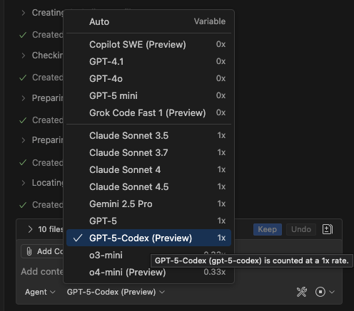

# Choosing the right Copilot model

Pick the brain that matches your task. GitHub Copilot lets you switch models per message so you can balance speed, reasoning depth, and code-editing power.

> 💡 **Tip:** Use the chat header’s **Model ▾** menu or assign your own keybinding to the “Copilot: Select Chat Model” command for quick switching.

### Quick navigation

- [1. Model lineup (October 2025)](#1-model-lineup-october-2025)
- [2. Quick decision guide](#2-quick-decision-guide)
- [3. Model switching playbook](#3-model-switching-playbook)
- [4. Premium request multipliers](#4-premium-request-multipliers)
- [5. Troubleshooting & best practices](#5-troubleshooting--best-practices)

## 1. Model lineup (October 2025)

| Model (version) | Category | What it shines at | When to reach for it |
| --- | --- | --- | --- |
| **Auto** | Dynamic chooser | Lets Copilot pick a model based on prompt complexity. | Staying in flow when you don’t want to micromanage model choice. |
| **Copilot SWE (Preview)** | Code specialist | Opinionated refactors, multi-file migrations, TODO tracking inside Edit mode. | Shipping scoped backlog items with structured checklists. |
| **GPT-4.1** | General-purpose | Balanced reasoning, code comprehension, and documentation quality. | Architecture discussions, specs, design trade-offs. |
| **GPT-4o** | General-purpose | Faster variant with fluent natural-language output and solid code quality. | Snappier chat replies, UX copy, lightweight design iterations. |
| **GPT-5 mini** | General-purpose | Fast, accurate coding replies with low latency. | Inline chat tweaks, quick bug fixes, CLI snippets. |
| **Grok Code Fast 1 (Preview)** | Coding surge | Rapid code generation across popular languages. | Experimenting with implementations, drafting diffs quickly. |
| **Claude Sonnet 3.5** | Narrative | Long-context synthesis with polished tone. | Summaries, PR reviews, content drafting. |
| **Claude Sonnet 3.7** | Hybrid | Strong reasoning paired with quick execution. | Modernization plans, QA guides, cross-file audits. |
| **Claude Sonnet 4** | Deep reasoning | Creative problem solving with enterprise-safe guardrails. | Complex algorithm explanations, architecture sketches. |
| **Claude Sonnet 4.5** | Deep reasoning | Expanded context window and higher accuracy. | Reviewing monorepos, compliance reviews, product spec alignment. |
| **Gemini 2.5 Pro** | Multimodal deep | Complex code generation and research workflows. | Data-heavy analysis, ML pipelines, cross-cloud scripting. |
| **GPT-5** | Flagship reasoning | Deep analysis, step-by-step planning, complex debugging. | Critical migrations, production fixes, security reviews. |
| **GPT-5-Codex (Preview)** | Code specialist | Multi-file edits, TypeScript/Python heavy lifting, structured diffs. | Executing plans in Edit mode when you need aggressive code output. |
| **o3-mini** | Reasoning | Algorithm design, mathematical verification, test oracle generation. | Validating logic, designing new data structures, ensuring invariants hold. |
| **o4-mini (Preview)** | Lightweight | Rapid answers with low usage overhead. | Spike solutions, brainstorming alternatives, hackathon flows. |

## 2. Quick decision guide

| Goal | Primary pick | Backup option | Notes |
| --- | --- | --- | --- |
| Draft a multi-step implementation plan | GPT-5 | GPT-4.1 | Ask for numbered steps, risks, and acceptance tests. |
| Execute sweeping refactors in Edit mode | GPT-5-Codex (Preview) | Grok Code Fast 1 (Promo) | Supply concrete TODOs and `#` context for impacted folders. |
| Review massive pull requests | Claude Sonnet 4.5 | GPT-5 | Combine with `#pull-request` + `@terminal /tests`. |
| Produce lightning-fast boilerplate | GPT-5 mini | o4-mini (Preview) | Use inline chat for minimal latency; proofread output quickly. |
| Investigate flaky tests with logs | GPT-5 | Claude Sonnet 3.7 | Attach `@terminal` and ask for hypotheses + rerun instructions. |
| Generate product copy or UX strings | GPT-4o | Claude Sonnet 3.5 | Request tone guidance and localization tips. |
| Explain data pipelines & notebooks | Gemini 2.5 Pro | GPT-4.1 | Pair with `@notebook` or `#dbclient-executeQuery`. |

## 3. Model switching playbook

1. **Scope with GPT-5:** `Outline risks in migrating #app/api from REST to GraphQL. Suggest stages.`
2. **Refactor using GPT-5-Codex:** `Apply the plan and update the routers, resolvers, and tests.`
3. **Cross-check with Claude Sonnet 4.5:** `Validate the patch against edge cases and list follow-up chores.`
4. **Polish docs via GPT-4o:** `Draft release notes explaining customer-facing changes.`

Switching preserves conversation history, so the finishing model inherits context and prior decisions.

## 4. Premium request multipliers

Stay mindful of how each model draws from your monthly premium request allowance. The table below summarizes the official multipliers from [Requests in GitHub Copilot](https://docs.github.com/en/copilot/concepts/billing/copilot-requests#model-multipliers) (October 2025).

| Model | Paid plans multiplier | Copilot Free multiplier | Notes |
| --- | --- | --- | --- |
| GPT-4.1 | 0× | 1× | Included with paid plans; free users spend one premium request per prompt. |
| GPT-5 mini | 0× | 1× | Fast default for paid plans; still metered on Copilot Free. |
| GPT-4o | 0× | 1× | Zero cost on paid plans, great for conversational polish. |
| GPT-5 | 1× | — | Premium reasoning; each prompt consumes one premium request. |
| GPT-5-Codex | 1× | — | Optimized for Edit mode and structured diffs. |
| o3 | 1× | — | High-reasoning OpenAI “o” series model. |
| o4-mini | 0.33× | — | Lightweight reasoning with one-third the premium cost. |
| Claude Haiku 4.5 | 0.33× | — | Fast, low-cost Anthropic option for summaries. |
| Claude Sonnet 3.5 | 1× | 1× | Available to Copilot Free and paid seats with the same rate. |
| Claude Sonnet 3.7 | 1× | — | Balanced reasoning for refactors and reviews. |
| Claude Sonnet 3.7 Thinking | 1.25× | — | Extended deliberation, slightly higher cost. |
| Claude Sonnet 4 | 1× | — | Enterprise-safe deep reasoning. |
| Claude Sonnet 4.5 | 1× | — | Larger context window for monorepos. |
| Claude Opus 4 / 4.1 | 10× | — | Premium flagship—use sparingly for the hardest problems. |
| Gemini 2.0 Flash | 0.25× | 1× | Efficient for multimodal/lightweight tasks; free plan pays 1×. |
| Gemini 2.5 Pro | 1× | — | Advanced multimodal reasoning. |
| Grok Code Fast 1 | 0.25× | — | Rapid code generation with low premium spend. |

> **Auto model selection discount:** On paid plans, enabling [Copilot auto model selection](https://docs.github.com/en/copilot/concepts/auto-model-selection) reduces each multiplier by 10% (for example, Claude Sonnet 4 bills at 0.9× instead of 1×).

> **Budgeting tip:** Track premium usage in **Settings → Copilot → Usage** and set budgets if you expect heavy GPT-5, Claude Opus, or Gemini 2.5 Pro usage.

## 5. Troubleshooting & best practices

- **Latency spikes?** Drop to GPT-5 mini or o4-mini for iteration, then return to GPT-5 for final reasoning.
- **Preview models missing?** Admins control access to premium models like GPT-5-Codex, Claude Sonnet 4.5, Grok Code Fast 1, and Gemini 2.5 Pro—check org policies if they’re hidden.
- **Large diffs timing out?** Split the work: ask GPT-5 to draft the plan, then feed GPT-5-Codex smaller chunks with specific `#folder` context.
- **Docs vs code?** Claude Sonnet excels at tone and long-form summaries, while GPT-5-Codex and Grok Code Fast 1 focus on code diffs.
- **Keep notes:** Use `/save` in chat to bookmark conversations that demonstrate effective model combos for teammates.
- **Pair with custom personas:** Many community chat modes and instructions in [Awesome GitHub Copilot Customizations](https://github.com/github/awesome-copilot) are tuned for specific models—install them to get point-in-time guidance that complements the choices above.

Explore [Advanced workflows](../advanced/README.md) to layer model switching with agent modes and TODO tracking.
